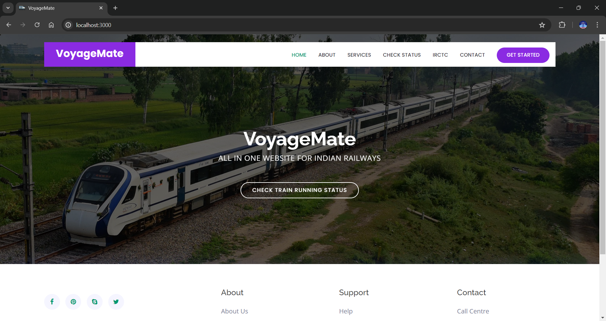

# VoyageMate

 <!-- Add a logo if you have one -->

## Overview

VoyageMate is a full-stack web application designed to enhance your travel experiences by providing personalized travel suggestions and live tracking features. Built using the MERN stack and integrated with machine learning, VoyageMate aims to offer seamless and secure travel planning.

## Features

- **User Authentication**: Secure login and registration using JWT.
- **Live Tracking**: Real-time trip tracking and PNR status checks.
- **Recommendation System**: Personalized travel suggestions based on past trips.
- **Interactive Dashboard**: User-friendly interface with comprehensive trip details.

## Tech Stack

- **Frontend**: ejs, HTML, CSS
- **Backend**: Node.js, Express.js
- **Database**: MongoDB
- **Machine Learning**: Integrated for personalized recommendations
- **Authentication**: JSON Web Tokens (JWT)

## Installation

1. **Clone the repository and Run**
   ```sh
   git clone https://github.com/mushtaq2314/VoyageMate-Project.git
   cd VoyageMate-Project
   npm i
   nodemon app1
